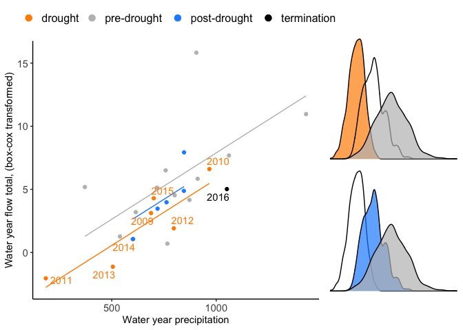

<!-- README.md is generated from README.Rmd. Please edit that file -->

# droughtshift

<!-- badges: start -->
<!-- badges: end -->

## Installation

``` r
devtools::install_github("IMMM-SFA/droughtshift")
```

## Usage

``` r
library(droughtshift)

# load example input data:
generate_example_droughtshift_input() -> ds_input

head(ds_input)
#> # A tibble: 6 × 4
#>   water_year precip   flow status     
#>        <int>  <dbl>  <dbl> <chr>      
#> 1       1997   1061  53.8  pre-drought
#> 2       1998    801  17.5  pre-drought
#> 3       1999    716  22.4  pre-drought
#> 4       2000    539   2.93 pre-drought
#> 5       2001    905 340    pre-drought
#> 6       2002    911  29.2  pre-drought

# create a droughtshift object
create_droughtshift_object(ds_input) -> ds_object

# plot the droughtshift object
plot_droughtshift_object(ds_object)
```


